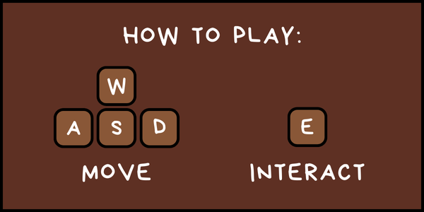

# 

<b>Dinner is Served</b> is a little cozy game with horror hints, set in an untidy cottage, where the Landlord has to tidy up and clean it before the arrival of the guests for dinner. Once the cottage is ready, it's time to welcome the guests and <i>serve the dinner</i>.

The game was made in 7 days during the <b>[Brackeys Game Jam 2024.2](https://itch.io/jam/brackeys-12)</b> jam, from 8 Sep 2024 to 15 Sep 2024, based on the theme “<i>Calm Before The Storm</i>”. Here is the game published on [Itch.io](https://stardice.itch.io/dinner-is-served).

## Gameplay
* Control the Landlord, moving around in the cottage between its rooms.
* Clean the dirty, fix objects and the mess, and pick up items to place in the right places.
* The list of tasks keeps traces of the housework.
* When all is ready, welcome the guests and have dinner.

## How to Play

## Requirements
If you want to open, edit or see the Unity project:
* Unity 2022.3.10f1 (https://unity.com/releases/editor/whats-new/2022.3.10)

## Credits
<i>All the assets were created from scratch during [Brackeys Game Jam 2024.2](https://itch.io/jam/brackeys-12), except for sound effects made using free licensed files on Freesound.org.</i>
### Team
📝 **Designers**
* Kevin Toninelli: https://github.com/KevinToninelli / https://kevintoninelli.itch.io/
* Michele Buonocunto: https://github.com/MicheleBuonocunto / https://michele-buonocunto.itch.io
* Mattia Solimeno: https://github.com/mattsoli / https://mattsoli.itch.io

💻 **Programmers**
* Pietro Di Giovanni: https://github.com/piedg / https://hcyan.itch.io
* Diego Gurrieri: https://github.com/diegogurr / https://diegogu.itch.io

🎨 **2D Artist**
* Lorenzo Racca: https://github.com/LorenzoRacca97 / https://lorenzo-racca.itch.io

🎹 **Composer**
* Claudio Monteleone: https://github.com/ForgottenDawn / https://forgottendawn.itch.io
